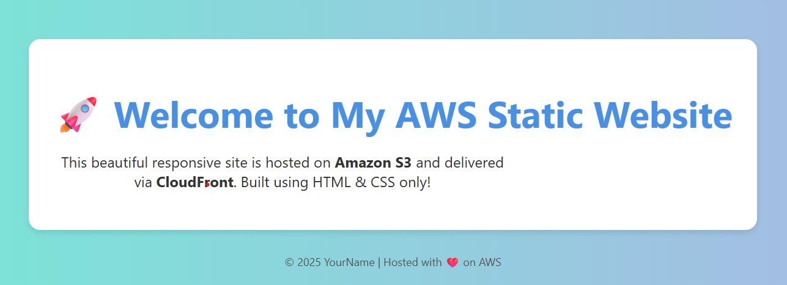

# aws-static-website
Static Website Hosting on AWS S3 + CloudFront

This project demonstrates how to host a static website on AWS using:
- Amazon S3 for website storage
- CloudFront for global content delivery
- (Optional) Route 53 for custom domain setup

##  Stack
- AWS S3
- CloudFront
- Route 53 (optional)
- HTML/CSS

## Screenshots

## Deployment Steps
1. Create S3 bucket with static website hosting
2. Upload contents of `/site`
3. Configure CloudFront with S3 origin
4. (Optional) Set up custom domain with Route 53

## What I Learned
- How to manage public access policies
- CloudFront caching and invalidation
